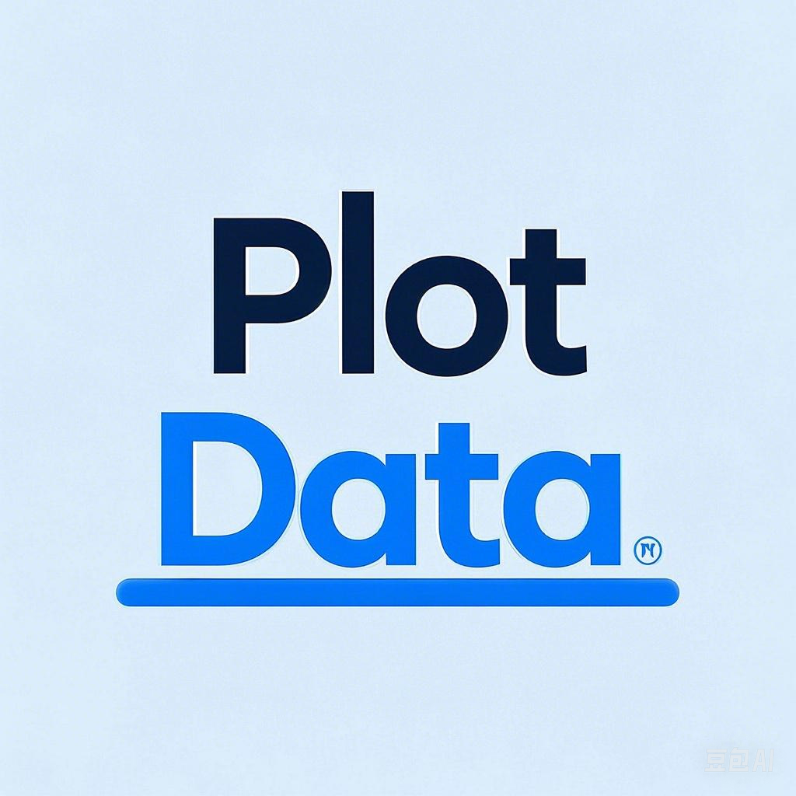

# PlotData



PlotData是一款基于Python的交互式数据可视化工具，提供简单易用的界面，帮助用户快速加载、处理和可视化数据。

## 功能特点

- **多格式数据支持**：支持CSV、Excel、JSON等多种数据格式的导入和导出
- **数据处理**：提供数据清洗、筛选、统计分析等功能
- **丰富的可视化**：支持散点图、折线图、柱状图、饼图、直方图、箱线图等多种图表类型
- **图表自定义**：可自定义标题、轴标签、颜色、样式等图表属性
- **主题切换**：支持深色/浅色主题切换
- **配置保存**：自动保存用户偏好设置和最近打开的文件

## 安装

1. 克隆仓库到本地：

```bash
git clone https://github.com/YuanweiWu911/PlotData.git

cd PlotData
```

2. 安装依赖:
```bash
pip install -r requirements.txt
```

3. 运行程序:
```bash
python main.py
```
## 使用说明
### 基本操作流程
1. 数据加载 ：通过"文件→打开"菜单或快捷键Ctrl+O加载数据文件
2. 数据预览 ：在数据视图中浏览和检查数据
3. 数据清洗 ：使用"数据→数据清洗"功能处理缺失值和异常值
4. 统计分析 ：在统计视图中查看数据的统计信息
5. 创建图表 ：在数据视图中选择列和图表类型，点击"绘制图表"
6. 自定义图表 ：调整图表的颜色、标记样式、大小等属性
7. 导出结果 ：保存图表为图片或导出处理后的数据
### 快捷键 功能 快捷键 打开文件

Ctrl+O 导出数据

Ctrl+E 退出程序

Ctrl+Q 切换主题

Ctrl+T 首选项设置

Ctrl+P 帮助内容

F1
## 项目结构
```
PlotData/
├── core/                # 核心功能模块
│   ├── __init__.py      # 包初始化
│   ├── config_manager.py # 配置管理
│   ├── data_manager.py  # 数据管理
│   └── visualization.py # 可视化引擎
├── ui/                  # 用户界面模块
│   ├── __init__.py      # 包初始化
│   ├── clean_dialog.py  # 数据清洗对话框
│   ├── data_view.py     # 数据视图
│   ├── help_dialog.py   # 帮助对话框
│   ├── main_window.py   # 主窗口
│   ├── plot_view.py     # 绘图视图
│   ├── preferences_dialog.py # 首选项对话框
│   └── stats_view.py    # 统计视图
├── resources/           # 资源文件
│   └── icon.png         # 应用图标
├── tests/               # 测试代码
├── __init__.py          # 包初始化
├── main.py              # 主程序入口
├── setup.py             # 安装配置
├── requirements.txt     # 依赖包列表
└── README.md            # 项目文档
```
## 技术栈
- PyQt6 : 用户界面框架
- Matplotlib : 图表绘制
- Pandas : 数据处理和分析
- NumPy : 数值计算
- setuptools : 包管理
## 开发指南
### 环境设置
推荐使用虚拟环境进行开发：

```bash
python -m venv venv
pip install -r requirements.txt
venv\Scripts\activate
 ```

### 代码规范
- 遵循PEP 8编码规范
- 类和方法需添加文档字符串
- UI组件命名规则：
  - 对话框类：XXXDialog
  - 视图类：XXXView
  - 信号命名：xxx_signal
### 测试
添加单元测试到tests目录，确保新功能和修复的bug有相应的测试覆盖。

## 贡献指南
欢迎提交Issue和Pull Request。请确保：

1. 代码符合PEP 8规范
2. 添加必要的单元测试
3. 更新相关文档
## 许可证
MIT License

## 联系方式
- 项目维护者： YuanweiWu911
- 问题反馈：请使用GitHub Issues
